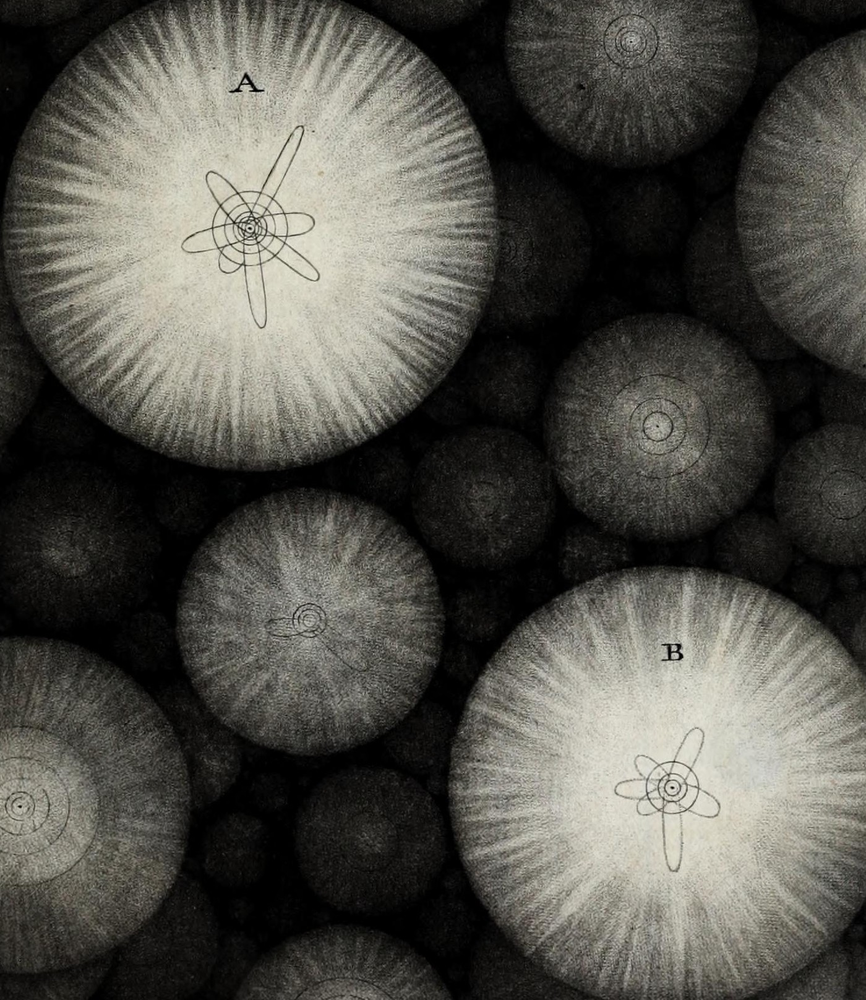

```{=html}
<div class="home-shell">
<section class="home-hero">
<figure class="home-art"></figure>
<div class="home-profile">
<p class="home-eyebrow">Sociology · Network science · Stratification &amp; inequality</p>
<h1>Roberto Cantillan</h1>
<p class="home-affiliation">PhD Candidate in Sociology<br>Pontificia Universidad Católica de Chile</p>
<p class="home-lead">I study how the skills and tasks required at work change over time, and how these changes contribute to inequality across occupations.</p>
<p class="home-detail">My broader research examines how social networks shape the spread of change and the persistence of relationships.</p>
<div class="home-actions"><a href="about/index.html">Explore research →</a><a href="pdf/CV_Roberto_Cantillan.pdf">View CV ↗</a><a href="contact.html">Contact</a></div>
<nav class="home-social" aria-label="Academic profiles">
<a href="https://github.com/rcantillan" aria-label="GitHub"><i class="bi bi-github" aria-hidden="true"></i></a>
<a href="https://cl.linkedin.com/in/roberto-cantillan-carrasco-67620517b" aria-label="LinkedIn"><i class="bi bi-linkedin" aria-hidden="true"></i></a>
<a href="https://orcid.org/0000-0003-0494-0692" aria-label="ORCID"><i class="ai ai-orcid" aria-hidden="true"></i></a>
<a href="https://scholar.google.com/citations?user=xZkAmvAAAAAJ" aria-label="Google Scholar"><i class="ai ai-google-scholar" aria-hidden="true"></i></a>
</nav></div></section>
<section class="home-section">
<div class="home-section-head"><h2>Current research</h2><a href="about/index.html">More about my work →</a></div>
<div class="home-cards">
<article class="home-card"><span class="home-number">01</span><h3>Work, skills & technology</h3><p>Work changes, but not evenly. I study how skills and tasks diffuse across the occupational hierarchy.</p></article>
<article class="home-card"><span class="home-number">02</span><h3>Relational persistence</h3><p>What makes a tie last? I examine how available alternatives shape the stability and replacement of social ties.</p></article>
<article class="home-card"><span class="home-number">03</span><h3>Mobility & inequality</h3><p>Emerging projects explore how relational structures shape urban and intergenerational mobility.</p></article>
</div></section>
<section class="home-section">
<div class="home-section-head"><h2>Recent work</h2><a href="talk/index.html">All talks →</a></div>
<article class="home-event"><div><time>Oct 2026</time><small>UPCOMING</small></div><div><h3>When Do Alternatives Threaten a Tie?</h3><p><a href="https://socialnetworksuc.cl/en/">Social Networks Group – UC</a></p></div><a href="https://rcantillan.github.io/slides/relational_persistence/slides.html#/title-slide">View slides →</a></article>
<article class="home-event"><div><time>Aug 2026</time></div><div><h3>A Matthew Effect in Occupational Skill Content</h3><p>RC28 Summer Meeting · New York University</p></div><a href="https://rcantillan.github.io/slides/rc28_nyu/slides_revised.html">View slides →</a></article>
<article class="home-event"><div><time>Jan 2026</time></div><div><h3>Structurally Conditioned Diffusion Reproduces Skills-Based Stratification</h3><p>RC28 International Conference · Sciences Po</p></div><a href="https://rcantillan.github.io/slides/coes_mobility/slides.html">View slides →</a></article>
</section></div>
```
