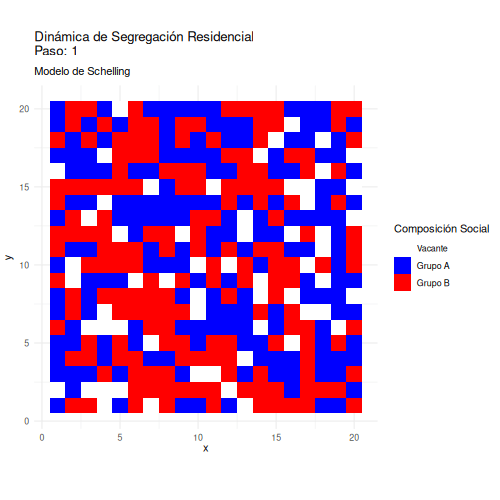
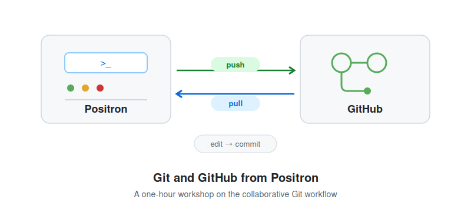

## Workshops & Tutorials

### Agent-Based Modeling con R 

[Repositorio ](https://github.com/rcantillan/ABM_workshop)

**Descripción:** Workshop introductorio a la modelación basada en agentes (ABM) utilizando R. Este taller proporciona una base sólida para comprender y desarrollar modelos de simulación social, con énfasis en la segregación residencial y la formación de vínculos sociales.

**Contenidos:**

- Fundamentos de ABM y simulación social
- Implementación de modelos en R
- Análisis de resultados
- Casos prácticos:
  - Modelo de Schelling
  - Formación de vínculos sociales
  - Contagio

**Requisitos previos:**

- Conocimientos de programación usando R

### Git and GitHub from Positron

[Repository ](https://github.com/mobility-frontiers/taller-git-positron-codex) · [View workshop ](https://mobility-frontiers.github.io/taller-git-positron-codex/taller.html)

**Description:** Introductory version control workshop focused on the collaborative R workflow in Positron. It covers authentication via personal access token, the lifecycle of a file across the working directory, staging area, and commit history, and the procedures for resolving conflicts when multiple people modify the same file. Includes a hands-on demo on a repository built specifically for this workshop.

**Contents:**

- Personal access token authentication
- The pull → edit → commit → push cycle
- Merge conflict resolution
- Branches and pull requests
- Using the AI assistant in Positron
- Troubleshooting common Git errors

**Prerequisites:**

- Positron and Git installed and configured
- GitHub personal access token

## Teaching

- [Introducción a las Ciencias Sociales Computacionales](https://github.com/rcantillan/OPR-219-CIencias-Sociales-Computacionales?tab=readme-ov-file)

## Recursos Adicionales

### Data

- [FRED](https://fred.stlouisfed.org/)
- [Skill UK](https://www.skillssurvey.co.uk/)
- [ESJS](https://www.cedefop.europa.eu/en/projects/european-skills-and-jobs-survey-esjs)

